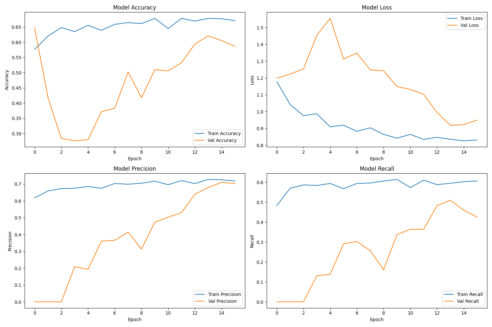

# apollodB - AI-Powered Music Emotion Analysis & EQ Optimization


apollodB is an AI system that combines cutting-edge music emotion recognition with personalized audio engineering. Analyze your music's emotional characteristics and generate custom EQ curves tailored to your listening preferences.

Note on architecture: The primary runtime is now a FastAPI backend (`backend/server.py`) with a JavaScript frontend served from `web/`. A legacy Streamlit app (`app.py`) remains for reference and parity testing.

## Features

### 🎯 Core Functionality
- **Deep Emotional Analysis**: AI-powered emotion recognition using the DEAM dataset
- **Multi-Song Analysis**: Upload and analyze multiple tracks for aggregate insights
- **Personalized EQ Generation**: Custom equalizer curves based on emotional analysis
- **Multiple EQ Formats**: Wavelet, Parametric, and Graphic EQ export options
- **Aggression Control**: Adjustable intensity for EQ modifications

### 📊 Advanced Visualizations
- **Valence-Arousal Space**: Interactive 2D emotional mapping
- **Emotion Distribution**: Pie charts showing emotional breakdown of your music
- **EQ Frequency Response**: Visual representation of generated equalizer curves
- **Statistical Analysis**: Comprehensive metrics and insights

### 🎧 IEM Integration
- **Squig.link Database**: Popular IEM frequency response information
- **Smart Recommendations**: IEM suggestions based on your music's emotional profile
- **Compatibility Guide**: Understanding how different IEMs complement your taste

### 🎵 Music Discovery
- **Spotify Integration**: Direct links to curated playlists matching your emotional profile
- **Mix Suggestions**: Automated playlist recommendations based on dominant emotions

## Technical Details

### Model Architecture
- **Training Dataset**: DEAM (Database for Emotional Analysis in Music)
- **Feature Extraction**: Log-mel spectrograms (128 mel bands, ~1300 time frames)
- **Neural Network**: Transformer-based classifier (PyTorch) with attention mechanisms
- **Emotion Categories**: Happy, Sad, Angry, Calm, Neutral (with bias correction)

### Audio Processing
- **Supported Formats**: MP3, WAV, M4A, FLAC
- **Sample Rate**: 22,050 Hz
- **Duration**: 30-second analysis windows
- **Feature Normalization**: Standardized using training data statistics

### EQ Generation
- **Frequency Range**: 20 Hz to 20 kHz (ISO 1/3 octave bands)
- **Psychoacoustic Basis**: Research-backed frequency-emotion correlations
- **Customizable Intensity**: User-controlled aggression parameter

## Installation

1. **Clone the repository:**
```bash
git clone <repository-url>
cd apollodB
```

2. **Install dependencies:**
```bash
pip install -r requirements.txt
```

3. **Ensure model files are present under `models/`:**
   - `models/best_val_loss.pth` — Trained emotion recognition weights (PyTorch)
   - `models/scaler_mean.npy` — Feature normalization mean
   - `models/scaler_scale.npy` — Feature normalization scale
   - `models/labels.json` — Emotion label mappings

4. **Run the application (FastAPI backend + JS frontend):**
```bash
uvicorn backend.server:app --host 0.0.0.0 --port 8080
# Open http://localhost:8080/
```

5. **Legacy Streamlit (optional):**
```bash
streamlit run app.py
```

## Usage

### Basic Analysis
1. Navigate to the "Analysis" tab
2. Upload one or more audio files
3. Adjust the EQ aggression slider (0.0 = subtle, 1.0 = dramatic)
4. Select your preferred EQ format
5. Click "Analyze Music" to process your files

### Understanding Results
- **Valence**: Emotional positivity (0 = negative, 1 = positive)
- **Arousal**: Energy level (0 = calm, 1 = energetic)
- **Dominant Emotion**: Most prevalent emotion across your music
- **EQ Curve**: Frequency adjustments optimized for your emotional profile

### EQ Export Formats

#### Wavelet EQ
```
GraphicEQ: 20 -0.1; 21 -0.0; 22 -0.0; ...
```

#### Parametric EQ
```
Low Shelf (100Hz): 1.5dB
Low Mid (500Hz): 0.5dB
Mid (2kHz): 2.0dB
High Mid (8kHz): 3.0dB
High Shelf (16kHz): 2.5dB
```

## Model Training Notes



### Dataset Considerations
- Trained on 4 primary emotion classes (excluding some neutral samples)
- Neutral class bias: Results with <93% confidence focus on non-neutral emotions
- Model outputs top 2 dominant emotions when neutral confidence is low

### Performance Characteristics
- Optimized for 30-second audio segments
- Best performance on high-quality audio files
- Robust to various musical genres and styles

## Cloud Run Deployment (Recommended)

Build and deploy using Google Cloud Build and Cloud Run.

1) Build container image:
```bash
gcloud builds submit --tag gcr.io/$(gcloud config get-value project)/apollodb2:latest
```

2) Deploy to Cloud Run (adjust region/limits as needed):
```bash
gcloud run deploy apollodb2 \
  --image gcr.io/$(gcloud config get-value project)/apollodb2:latest \
  --platform managed \
  --region us-central1 \
  --allow-unauthenticated \
  --port 8080 \
  --cpu 2 --memory 2Gi \
  --max-instances 50 \
  --min-instances 0 \
  --timeout 900s \
  --set-env-vars=UVICORN_WORKERS=1,TORCH_NUM_THREADS=1,OMP_NUM_THREADS=1,MPLBACKEND=Agg
```

Notes:
- The app respects `$PORT` from the environment; default 8080 for local.
- Container includes `ffmpeg`, `libsndfile1`, `libgomp1` for audio/numba; `MPLBACKEND=Agg` for headless spectrograms.

## Design Philosophy

### Visual Aesthetic
- **Color Palette**: Black, grey, white, cyan only
- **Typography**: Roboto Bold throughout
- **Theme**: Cyberpunk meets Greek classicism
- **Layout**: Clean, modern, professional

### User Experience
- Intuitive interface with progressive disclosure
- Real-time feedback and loading indicators
- Comprehensive help and documentation
- Mobile-responsive design

## Scientific Foundation

apollodB is built on peer-reviewed research in:
- Music Information Retrieval (MIR)
- Affective Computing
- Psychoacoustics
- Audio Engineering
- Machine Learning

See the "References" tab in the application for detailed citations.

## FAQ

### Technical Questions
**Q: How accurate is the emotion detection?**
A: The model achieves competitive performance on the DEAM benchmark. However, individual perception of musical emotion can be subjective.

**Q: Why focus on valence-arousal instead of basic emotions?**
A: The valence-arousal model provides a more nuanced, continuous representation of emotional space, allowing for better EQ personalization.

**Q: Can I use the EQ settings with any audio equipment?**
A: Yes, the exported EQ curves are compatible with most software and hardware equalizers that support the respective formats.

### Privacy & Data
**Q: Is my music data stored or shared?**
A: No. All processing is done locally, and temporary files are immediately deleted after analysis.

**Q: Does apollodB require an internet connection?**
A: Only for the Spotify integration feature. All emotion analysis and EQ generation work offline.

## Contributing

We welcome contributions! Areas of interest:
- Additional emotion models
- New EQ curve generation algorithms
- Enhanced visualizations
- Mobile app development
- Extended IEM database

## License

**All Rights Reserved** - This software is proprietary and protected by copyright law. 

Copyright (c) 2025 Parikshit Kumar. All rights reserved.

Unauthorized copying, distribution, or use is strictly prohibited. For commercial licensing inquiries, contact: parikshitkumar1@gmail.com

See [LICENSE](LICENSE) for complete terms.


